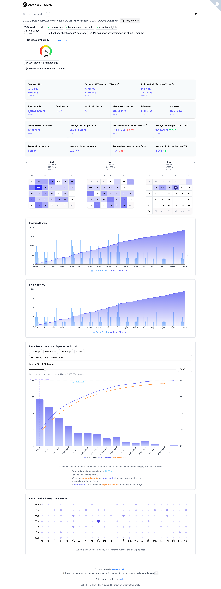

# AlgoNodeRewards

[](https://github.com/cryptomalgo/algonoderewards/actions/workflows/ci.yml)
[](https://opensource.org/licenses/MIT)

[](https://react.dev/)
[](https://www.typescriptlang.org/)
[](https://vitejs.dev/)

[](https://x.com/cryptomalgo)

A React application to track and visualize the rewards from running an Algorand node, using [Nodely](https://nodely.io/) API.

## Website

You can access the website at [algonoderewards.com](algonoderewards.com)



## Features

- Rewards statistics
  Total rewards

  - Total blocks
  - Max blocks/rewards in a day
  - Min/max reward
  - Average rewards per day/month total/last 30D/last 7D
  - Average blocks per day/month total/last 30D/last 7D
  - Monthly heatmap statistics
  - Rewards History chart
  - Blocks History chart
  - Block Distribution chart by Day and Hour

- Responsive design for both desktop and mobile
- Dark/light/system theme modes
- Real-time exchange rate in USD (from Binance)
- CSV export

## Development Setup

```bash
# Install dependencies
npm install

# Start development server
npm run dev

# Lint & test
npm run ci

# Build for production
npm run build
```

## Deploy

The project is automatically deployed to [](https://pages.cloudflare.com/)
on each push to the main branch. The production website is available at [algonoderewards.com](https://algonoderewards.com).

## License

[](LICENSE)
